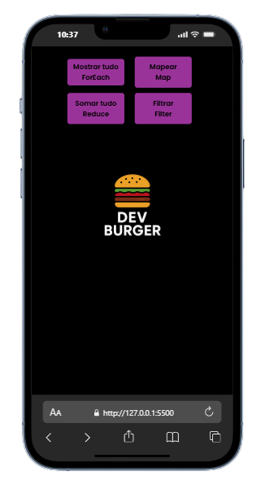
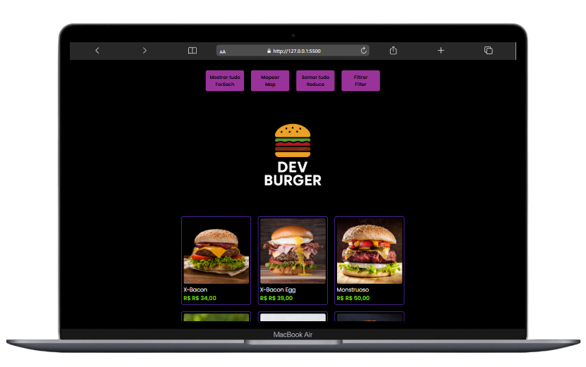

# 🍔 Dev Burger - Sistema de Pedidos em JavaScript

Este projeto foi desenvolvido com o objetivo de praticar e aplicar as principais ferramentas de manipulação de arrays em JavaScript:  
**`forEach`**, **`map`**, **`reduce`** e **`filter`**.

Através da simulação de um sistema de pedidos para uma hamburgueria, o código demonstra como essas funções podem ser utilizadas para:

- Listar produtos dinamicamente
- Filtrar itens com desconto
- Calcular o total do pedido

Além disso, o projeto utiliza **HTML** e **CSS** para estruturar e estilizar a interface de forma responsiva e intuitiva.

---

## 🚀 Funcionalidades

- 📋 Listagem de produtos com nome, imagem e preço 
- ➕ Botão para esolher preferência
- 🧾 Resumo do pedido com total calculado
- ✅ Botão para saber o valor do desconto

---

## 🖼 Demonstração

<p align="center">
  
  
</p>

---

## 🛠 Tecnologias utilizadas

- **HTML5** → Estrutura da página  
- **CSS3** → Estilização responsiva e visual moderno  
- **JavaScript (Vanilla JS)** → Lógica de interação e manipulação de dados  

---


## 📂 Estrutura de arquivos

```plaintext
├── index.html       # 🧱 Página principal do sistema
├── style.css        # 🎨 Estilo da interface
├── script.js        # 🧠 Lógica de prefência e desconto 
└── img/             # 🖼️ Imagens dos produtos e da interface
```

---

▶️ Como usar

- Abra o arquivo index.html no navegador

- Navegue pelo cardápio e adicione os itens desejados

- Visualize o resumo do pedido no carrinho

- Finalize o pedido e receba a confirmação

---

-📌 Melhorias futuras

-💵 Sistema de compra

-💳 Implementação de pagamento online

-📱 Versão mobile com animações e transições

🗂️ Armazenamento dos pedidos em banco de dados

---

## 📄 Licença

-Este projeto foi desenvolvido com fins educacionais como parte dos estudos realizados na plataforma **DevClub**, sob orientação do professor **Rodolfo Mori**.

-Você pode utilizar, modificar e compartilhar este código livremente para fins de aprendizado e prática pessoal.  
Caso deseje utilizar em projetos públicos ou comerciais, recomenda-se manter os créditos originais.

**Todos os direitos de ensino e metodologia pertencem ao DevClub e Rodolfo Mori.**

🚀 Aprenda mais em: [https://devclub.com.br](https://devclub.com.br)

